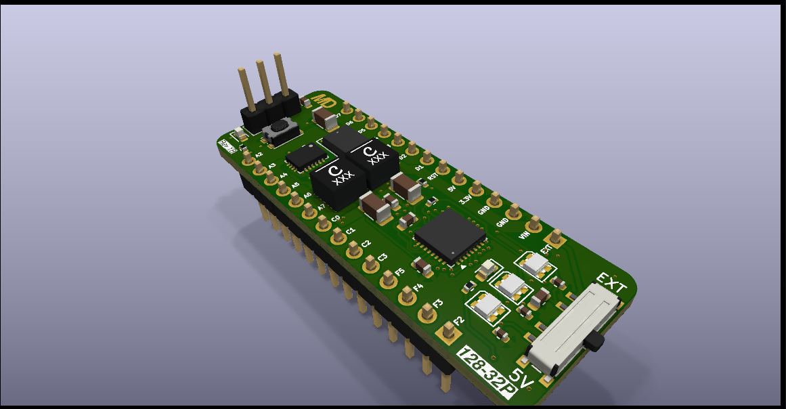
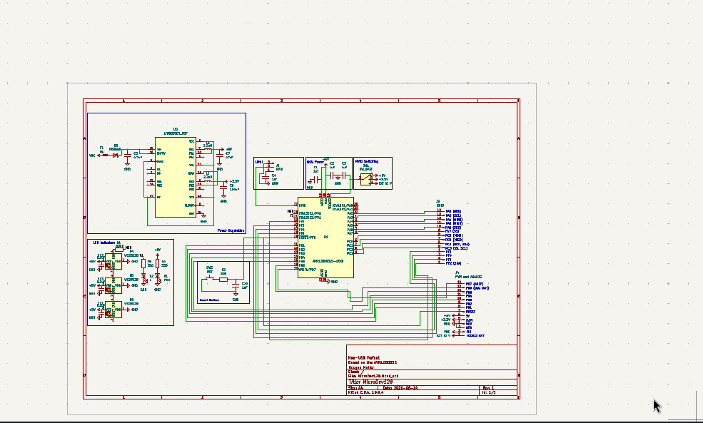
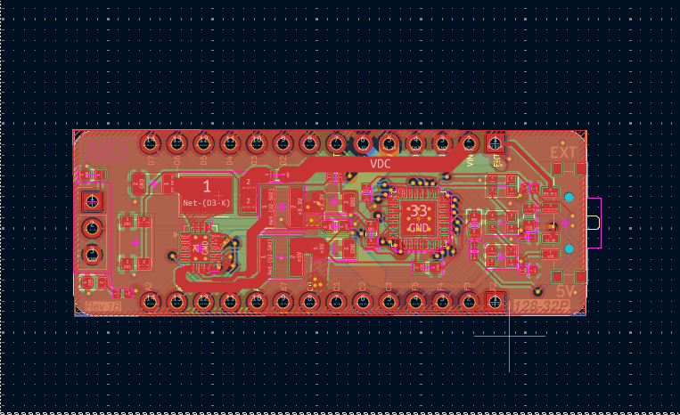

### *Thank You to PCBWay for sponsoring this project! To see more look up the "Sponsorship Section"*

---

# MicroDev128-32P
## A high-power development/prototyping board with MVIO. 

Based on the AVR128DB32. 

The MicroDev128-32P is open-source development board with a high-power voltage regulator with up to 2A continous, Multi-voltage IO - which allows PortC to run on a different voltage than the rest of the board - elimenating the need for voltage level shifters. The MicroDev128-32P aims to be better price to performance ratio than a tradition Arduino Nano. To view the Schematics you can go into the Kicad files folder. All files were made on KiCad 10.04 and should import without other dependencies. The 3D models are all included in the folder. 

**Key Specifications:**
- Up to 2A continuos on both power lines, 3.3v and 5v with up to 42VDC input
- Arduino Nano sized footprint, allowing it to easily be plugged into breadboards
- 128kB Flash, 16kB SRAM, and 512B EEPROM
- Has with internal clock adjustable up to 24MHz max
- Built in reverse polarity protection, fuse and overcurrent/short protection
- UPDI Header for programming 
- Onboard LED and 3 programble, seperatly adressable NeoPixels

## Documentation

For Documentation see the MicroDev128 Docs repository. This includes technical information such as regulator ripple, tests etc. 
[Link to Documents](https://github.com/ILikeBWRs/MicroDev128-Documentation)

---

## Images

---

## Sponsorship

[PCBWay](https://pcbway.com) is a professional manufacturing service that offers PCB fabrication, PCB assembly, CNC machining, sheet metal fabrication, injection molding, and high-quality 3D printing services. They support a wide range of materials, including stainless steel, aluminum, titanium, and engineering plastics, making them suitable for prototype and production projects.
For my project they gave me five indivdual PCBs of outstanding surface quality. They surface was flat and smooth - with a perfect ENIG coating - with the corners rounded and deburred. The end application of this project is a Microcontroller board, suitable to be used in many situations. To see how easy their ordering procsess is go to the ordering section. 

## Samples

A big thank you to the sample programs of the following manufactures:
 - Microchip Technology
 - Analog Devices
 - Coilcraft
 - Würth Elektronik

---

## Ordering

To order your own you have a few ways:

**1. Order Blank PCBs and assemble them yourself**

*You will need a hotplate for solder reflow and solder paste. May be cheaper but harder to do!*

Upload the Gebers at:
/MicroDev128-32P Production Files
   /Gebers.zip
Go to PCBWay's online ordering page and upload the gebers. Make sure it says 4-layers. Set it to ENIG, and set the solder mask to any colour you want. The rest of the default settings will be fine. Hit order or add stencil if you need one. It's that easy!

Next in the same folder find the BOM.csv and order the parts from your favorite part distributor. 
To lay out components once they turn up you can use the KiCad PCB layout. A dedicated image for this step will come later.

**2. Use PCBWay's PCBA service and get them shipped assembled**

Upload the Gebers at:

/Production Files

   /Gebers.zip
   
Go to your PCB and upload the gebers. Make sure it says 4-layers. Set it to ENIG, and set the solder mask to any colour you want. The default settings will be fine.
Then upload the BOM.csv and CPL.csv to the page. Then check if they in stock. (You may need to pre-order some parts!)
The check component orientation - it has a tendency to flip the LT8653S by 90 degrees. 
Then pay and let PCBWay's professional automated factory ship them fully assembled, right to your door!

---

## Revision Information

This repository was last updated: *2026-09-12*

This design is revision: *1B*
